# The Panel

<div align="center">


**English** | [简体中文](README_CN.md)

**A powerful, user-friendly, web-based server management panel.**

*Streamline the administration of instances, files, and users with a modern interface. Whether you are managing raw Shell commands or Docker containers, Panel provides seamless control.*

[Features](#-features) • [Quick Start](#-quick-start) • [Configuration](#-configuration) • [Screenshots](#-screenshots)

</div>

---

## ✨ Features

### 🖥️ Instance Management
Take full control of your services with support for both **Shell** and **Docker** environments.
-   **Lifecycle Control**: Create, start, stop, restart, and terminate instances with one click.
-   **Docker Mastery**: Configure images, ports, volumes, working directories, and custom commands effortlessly.
-   **Automation**: Set auto-start on boot, auto-restart on failure, and auto-delete on exit.
-   **Monitoring**: Real-time CPU and Memory usage tracking.
-   **Web Terminal**: Full interactive terminal access for every instance.
-   <details><summary>📷 <i>View Screenshots</i></summary><br>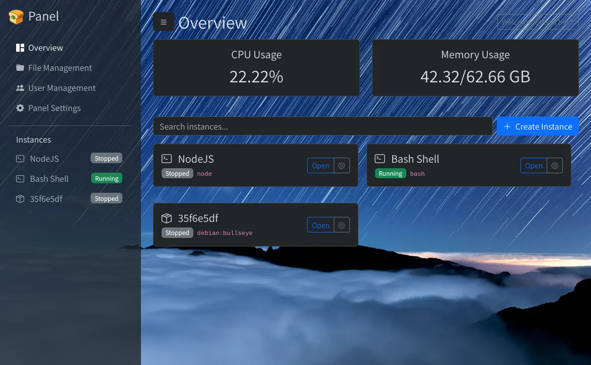<br>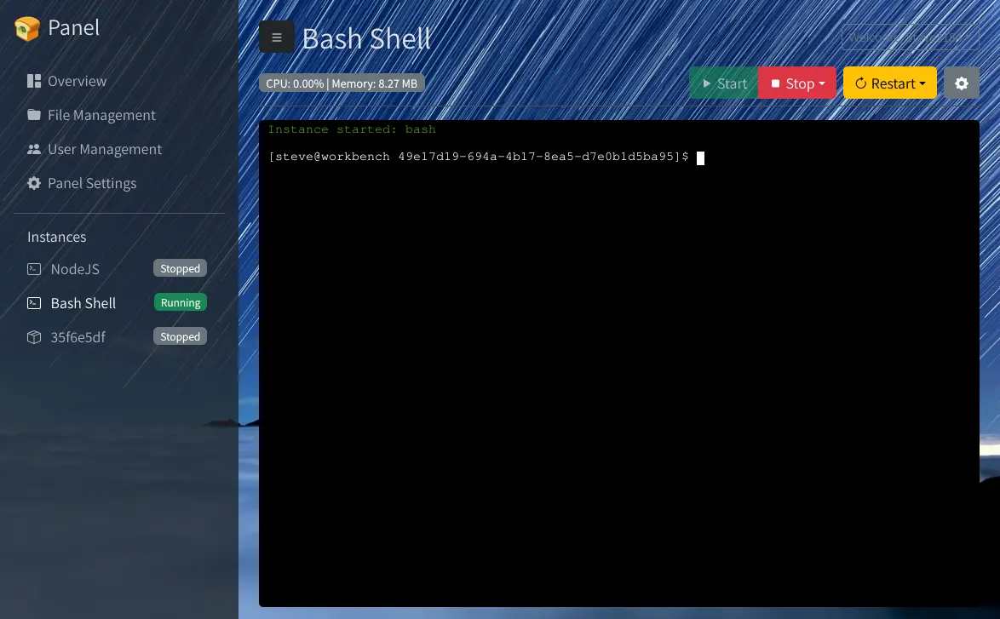<br>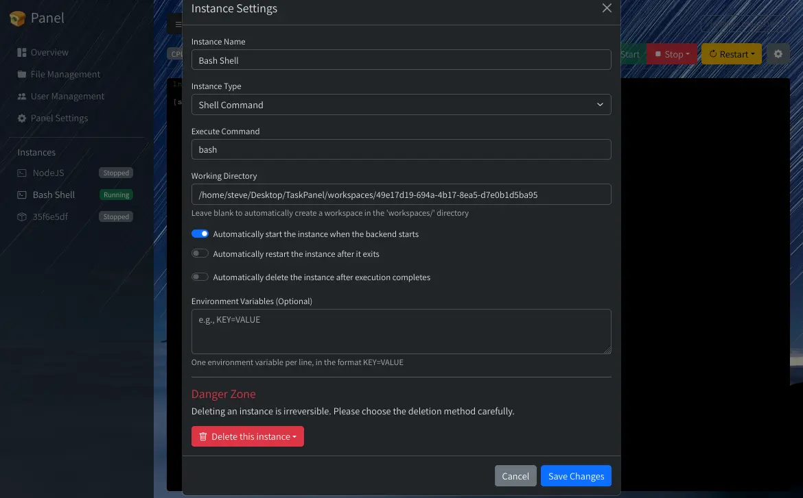</details>

### 👥 User & Permission RBAC
Secure and flexible user management designed for teams.
-   **Roles**: Distinct `admin` and `user` roles.
-   **Granular Control**: Define permissions per instance:
    -   *Terminal*: No Access, Read-only, Read/Write, or Full Control.
    -   *Files*: Toggle file management access.
-   **Security**: Secure password updates and account management.
-   <details><summary>📷 <i>View Screenshots</i></summary><br>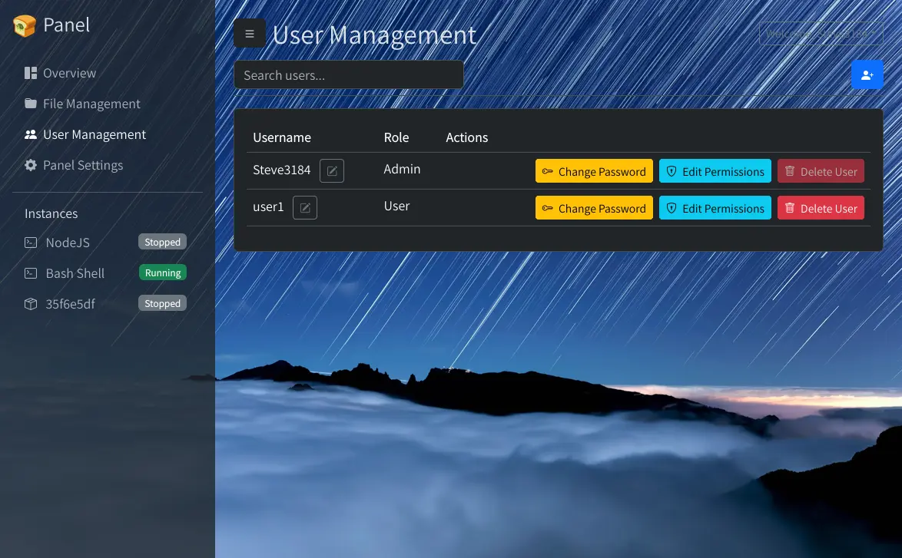<br>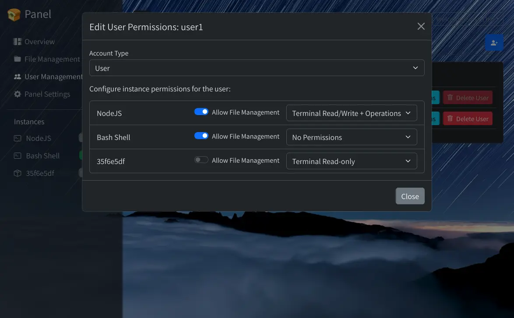</details>

### 📂 Advanced File Management
A desktop-class file manager directly in your browser.
-   **Operations**: Navigate, create, rename, copy, move (cut-paste), and delete.
-   **Transfer**: Chunked uploads for large files and easy downloads.
-   **Code Editor**: Monaco Editor integration (VS Code style) with syntax highlighting and real-time websocket sync.
-   **Archives**: Compress (zip, 7z, tar.gz, etc.) and Extract (zip, tar, bz2, etc.) directly on the server.
-   **Safety**: Blacklist protection for binary/system files.
-   <details><summary>📷 <i>View Screenshots</i></summary><br>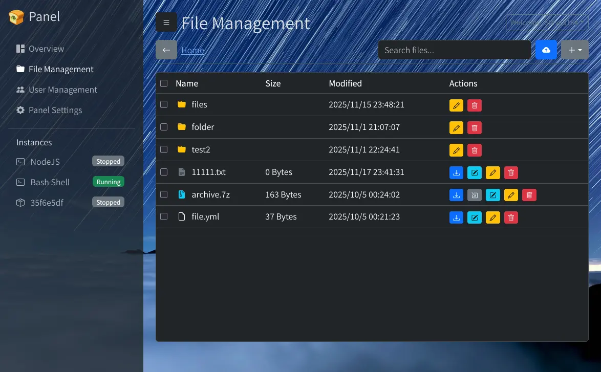<br>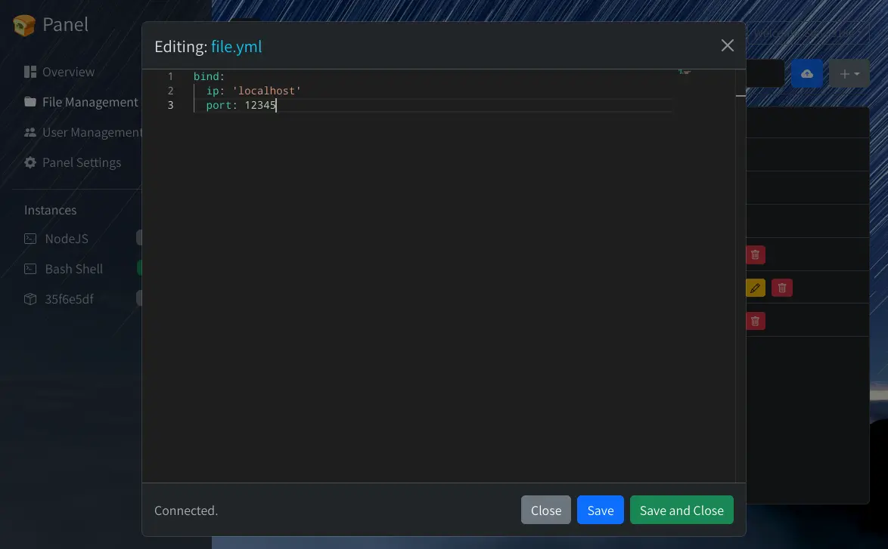</details>

### 🔗 Connectivity & Access
-   **WebDAV Support**: Mount your instance files locally via WebDAV (`/api/dav/<instance-id>/`).
-   **Gradio Tunnel**: Built-in remote access (no FRP/port forwarding required).
-   **Internationalization**: Full i18n support (EN, CN, JP, etc.).
-   **Responsive Design**: Works perfectly on mobile, tablet, and desktop.

---

## 🚀 Quick Start

### Prerequisites
*   **Node.js**: v22 or higher
*   **Unzip**: For extracting releases
*   **Docker**: (Optional) For container management
*   **7-Zip**: (Optional) For advanced archiving features

### Installation

#### Option 1: Install from Release (Recommended) ⚡
*Fastest deployment. No building required.*

```bash
# 1. Install Node.js 22 and tools
curl -sL https://deb.nodesource.com/setup_22.x | bash -
sudo apt install -y nodejs unzip

# 2. Download and extract
sudo mkdir -p /opt/panel && cd /opt/panel
sudo wget https://github.com/Steve3184/panel/releases/download/latest-build/release.zip
sudo unzip release.zip && sudo rm release.zip

# 3. Install dependencies
sudo npm install --prod

# 4. Setup Systemd Service
sudo wget -O /etc/systemd/system/panel.service https://raw.githubusercontent.com/Steve3184/panel/main/panel.service
sudo systemctl daemon-reload
sudo systemctl enable panel
sudo systemctl start panel
```

#### Option 2: Build from Source 🛠️
*For developers or custom builds.*

<details>
<summary>Click to expand build instructions</summary>

1.  **Install Node.js 22:**
    ```bash
    curl -sL https://deb.nodesource.com/setup_22.x | bash -
    sudo apt install -y nodejs
    ```

2.  **Clone Repository:**
    ```bash
    sudo git clone https://github.com/Steve3184/panel.git /opt/panel
    cd /opt/panel
    ```

3.  **Install Dependencies & Build:**
    ```bash
    npm install
    cd frontend && npm install
    npm run build --prefix frontend
    ```

4.  **Configure Service:**
    ```bash
    sudo cp panel.service /etc/systemd/system/
    # Edit service file if path differs from /opt/panel
    sudo systemctl daemon-reload
    sudo systemctl enable panel
    sudo systemctl start panel
    ```
</details>

### Initial Setup
Access the panel at `http://localhost:3000`.
If no admin exists, you will be redirected to `/setup` to create the first account.

---

## ⚙️ Configuration

### Environment Variables
You can configure the panel via environment variables or by modifying `src/server.js`.

| Variable | Description | Default |
| :--- | :--- | :--- |
| `SESSION_SECRET` | Key used to sign the session ID cookie. **Change this in production.** | |
| `PORT` | The port the server listens on. | `3000` |
| `PANEL_LANG` | Server-side language (e.g., `jp`, `en`, `zh_CN`). | `en` |

**Setting variables in `panel.service`:**
Edit `/etc/systemd/system/panel.service` and add `Environment` lines under `[Service]`:

```ini
[Service]
Environment="SESSION_SECRET=MySuperSecretKey123"
Environment="PORT=8080"
ExecStart=/usr/bin/node src/server.js
```
*Remember to run `sudo systemctl daemon-reload && sudo systemctl restart panel` after changes.*

### 🌍 Remote Access (Gradio Tunnel)
The panel includes built-in tunneling capabilities using Gradio, allowing you to access your panel from the public internet without configuring router port forwarding or setting up FRP.

1.  Go to **Panel Settings** in the panel.
2.  Enable **Gradio Tunnel**.
3.  **Crucial**: Set a `Share Token`. This ensures your public URL remains constant. Without it, a random URL is generated on every restart.
4.  Wait a moment, then refresh the Settings page to see your public link.

### 🎨 UI Customization
Make the panel your own via the **Panel Settings** page:
-   **Title**: Change the browser tab and header title.
-   **Logo**: Upload a custom image for the top-left corner.
-   **Background**: Set a custom wallpaper for the login screen and dashboard.

---

## 📸 Screenshots

| Login Page | Instance Terminal | Panel Settings |
| :---: | :---: | :---: |
| 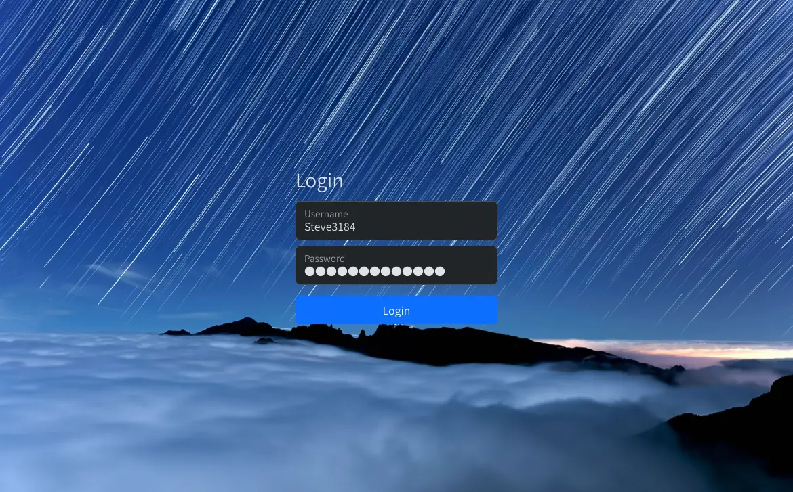 |  | 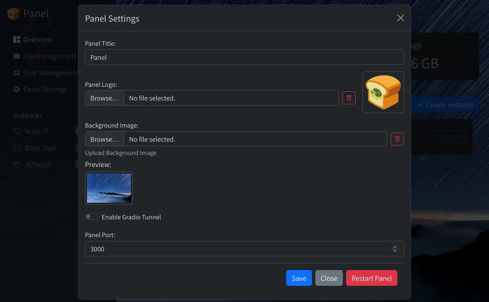 |

| Docker Instance Settings | Compress Files |
| :---: | :---: |
| 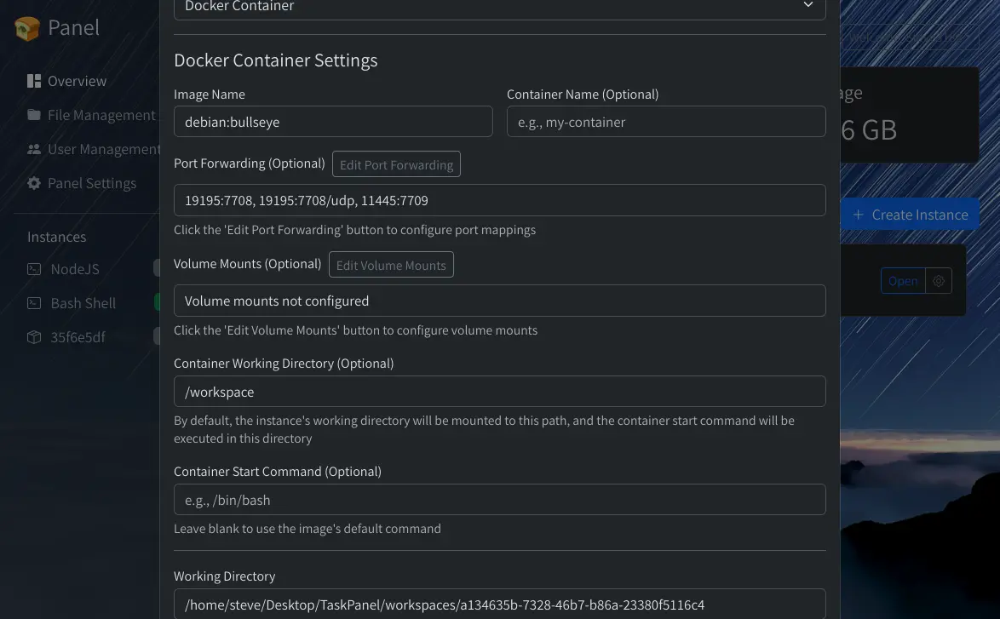 | 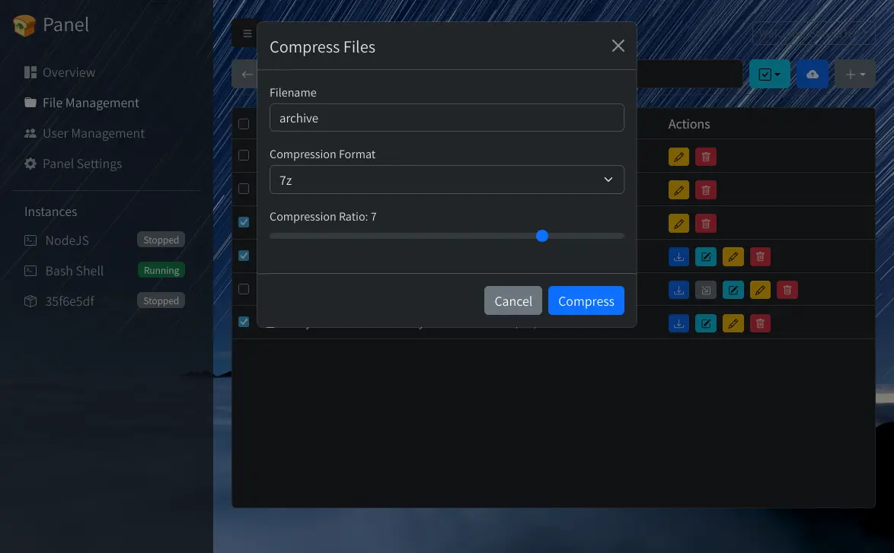 |

---

## 🤝 Contributing

Contributions make the open-source community an amazing place to learn, inspire, and create. Any contributions you make are **greatly appreciated**.

## 📄 License

Distributed under the MIT License. See `LICENSE` for more information.

## ⚠️ Disclaimer

**Windows Compatibility**: This panel is primarily developed for **Linux** environments. While it may run on Windows, functionality is not guaranteed and compatibility issues may arise.

<br>

<p align="center">
  <small><i>This repository contains code that was generated or assisted by AI.</i></small>
</p>