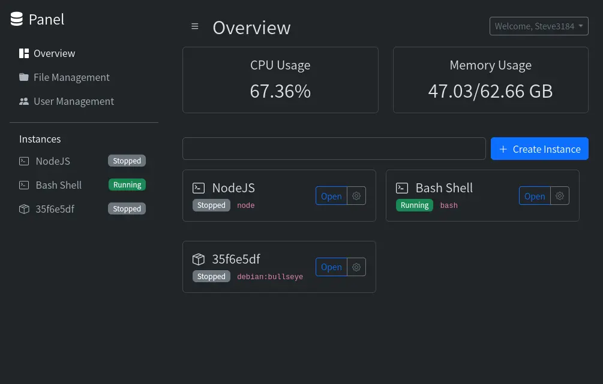
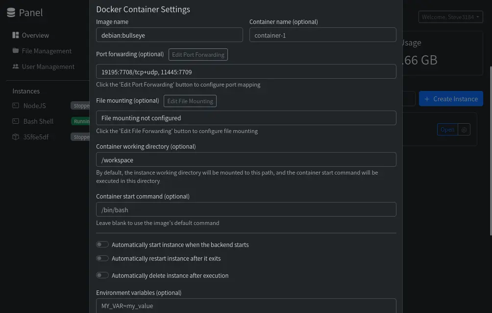
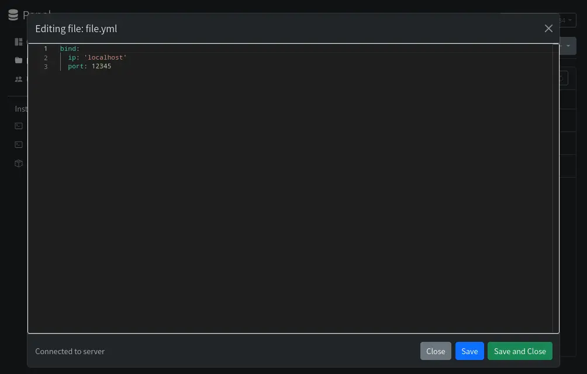
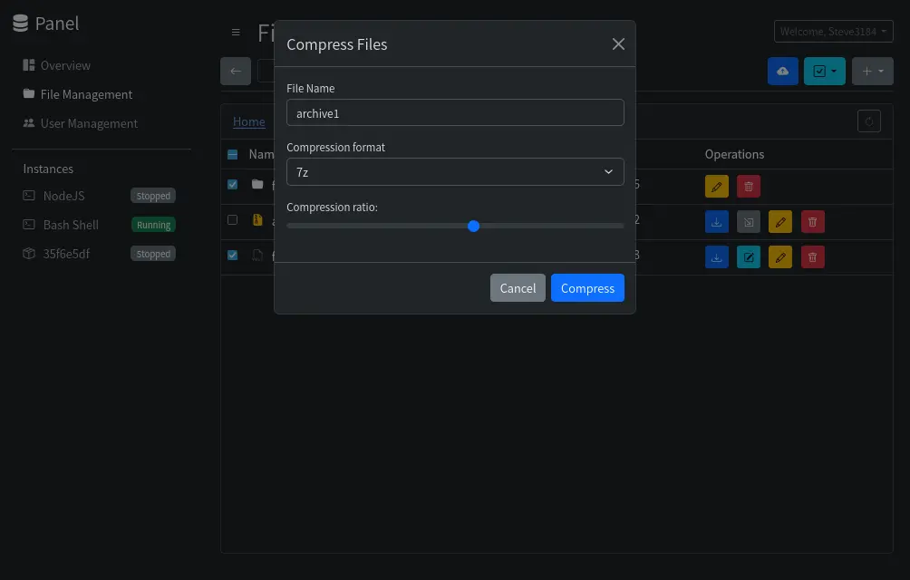
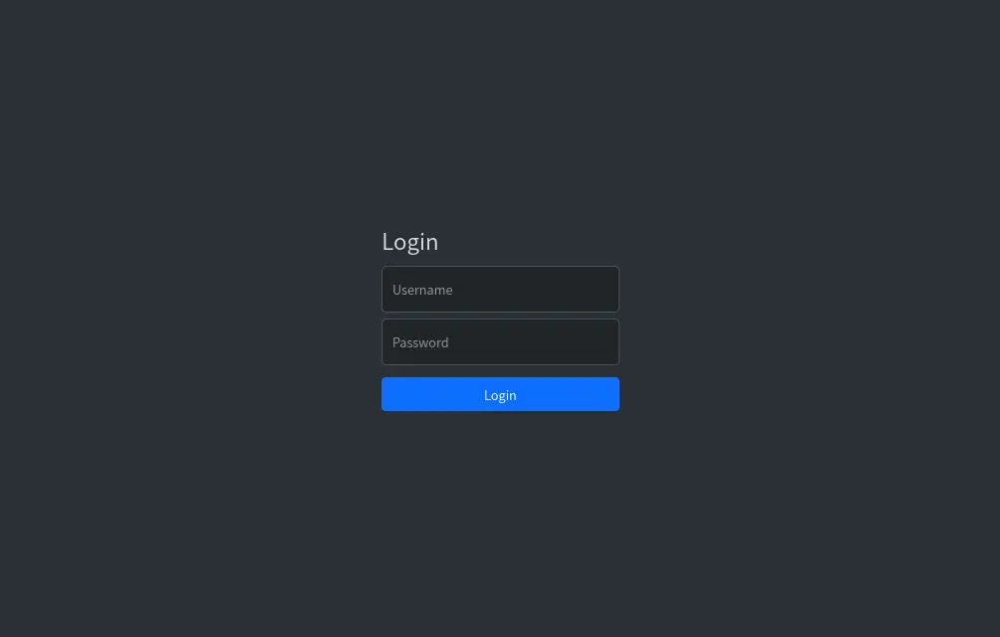

# The Panel

English | [简体中文](README_CN.md)

A powerful and user-friendly web-based server management panel designed to streamline the administration of instances, files, and users. Whether you're running shell commands or managing Docker containers, Panel provides a comprehensive interface for seamless control.

## ✨ Features

-   **Instance Management**:
    -   Effortlessly create, start, stop, restart, and terminate instances.
    -   Supports both **Shell** and **Docker** instance types.
    -   Comprehensive Docker configuration options: image, container name, port mappings, volume mounts, working directory, and custom commands.
    -   Configurable auto-start on boot, auto-delete on exit, and auto-restart for robust operation.
    -   Real-time monitoring of CPU and memory usage for each instance.
    -   Interactive terminal access for all running instances.
    -   <details><summary>Screenshot: Instance Overview</summary></details>
    -   <details><summary>Screenshot: Docker Instance Settings</summary></details>

-   **User & Permission Management**:
    -   Centralized user management for creating, deleting, and editing user accounts.
    -   Role-Based Access Control (RBAC) with `admin` and `user` roles.
    -   Admins can manage all aspects of users and instances.
    -   Granular permission settings per instance:
        -   **Terminal Access**: No access, Read-only, Read/Write, Read/Write & Operate (Start/Stop/Restart), Full Control.
        -   **File Management**: Enable or disable file management features.
    -   Secure password and username update functionalities.
    -   <details><summary>Screenshot: User Management</summary></details>
    -   <details><summary>Screenshot: Instance Permissions</summary></details>

-   **File Management**:
    -   Intuitive file browser for navigating, creating, deleting, and renaming files and folders.
    -   Efficient file upload (supports chunked uploads for large files) and download capabilities.
    -   **Online File Editor**: Integrated Monaco Editor with syntax highlighting for various languages, real-time saving, and WebSocket-based content synchronization.
    -   **Archiving Operations**: Supports file compression (zip, 7z, tar.gz, tar.xz) and extraction (zip, 7z, tar, tar.gz, tar.xz, tar.bz2) directly within the panel.
    -   Copy and move (cut-paste) operations for flexible file organization.
    -   File editing blacklist to prevent accidental modification of binary or unsupported file types.
    -   <details><summary>Screenshot: File Browser</summary></details>
    -   <details><summary>Screenshot: Online File Editor</summary></details>
    -   <details><summary>Screenshot: File Upload</summary></details>
    -   <details><summary>Screenshot: File Compression</summary></details>
    -   <details><summary>Screenshot: File Extraction</summary></details>

-   **Internationalization (i18n)**:
    -   Full multi-language support on both frontend and backend for a localized experience.

-   **Responsive UI**:
    -   Modern and responsive user interface adapts to various screen sizes, providing a consistent experience across desktops, tablets, and mobile devices.
    -   Collapsible sidebar and dynamic layout adjustments in the file manager for optimal usability.

## 🚀 Quick Start

### Prerequisites

-   Node.js (v22 or higher)
    -   **Quick Node.js 22 Installation on Ubuntu/Debian**:
        ```bash
        curl -sL https://deb.nodesource.com/setup_22.x | bash -
        apt install nodejs
        ```
-   Docker (Optional, for Docker instance management)
-   7-Zip (For advanced archiving operations, usually pre-installed on most systems or handled by `7zip-bin` package)

### Installation

**Recommended Installation as a systemd Service (for Linux Devices):**

For optimal operation, it is recommended to install Panel as a systemd service. This ensures it runs continuously in the background and starts automatically on system boot.

1.  **Install Node.js 22 (if not already installed):**
    ```bash
    curl -sL https://deb.nodesource.com/setup_22.x | bash -
    sudo apt install -y nodejs
    ```

2.  **Clone the repository to `/opt/panel`:**
    ```bash
    sudo git clone https://github.com/Steve3184/panel.git /opt/panel
    cd /opt/panel
    ```

3.  **Install dependencies:**
    ```bash
    npm install
    cd frontend && npm install
    ```

4.  **Build the frontend:**
    ```bash
    npm run build --prefix frontend
    ```


5.  **Copy and configure the systemd service file:**
    - a.  Copy the provided `panel.service` file to the systemd directory:
        ```bash
        sudo cp panel.service /etc/systemd/system/
        ```
    - b.  Edit the service file to ensure `WorkingDirectory` and `ExecStart` point to the correct paths. Since we cloned to `/opt/panel`, the default `panel.service` should already be configured correctly. If you chose a different installation path, you would modify it as follows:
        ```
        # Example modification if your project is in /home/user/panel
        # WorkingDirectory=/home/user/panel
        # ExecStart=/usr/bin/node /home/user/panel/src/server.js
        ```
        **Note**: The `ExecStart` path must be the absolute path to `server.js`.

6.  **Reload systemd, enable, and start the Panel service:**
    ```bash
    sudo systemctl daemon-reload
    sudo systemctl enable panel
    sudo systemctl start panel
    ```

7.  **Check the service status:**
    ```bash
    systemctl status panel
    ```

8.  **Initial Setup:**
    On first launch, if no admin user exists, you will be redirected to `http://localhost:3000/setup` to create an admin account.

### Configuration

You can configure the server language by setting the `PANEL_LANG` environment variable. For example, to set the language to Japanese:

```bash
PANEL_LANG=jp npm start
```

Supported languages are defined in the `frontend/public/lang/` directory (e.g., `en.json`, `zh_CN.json`, `jp.json`).

## 📸 Screenshots

-   **Login Page**:
    

-   **Overview Dashboard**:
    

-   **Instance Terminal**:
    

-   **Create Instance Modal**:
    

-   **File Manager - Directory View**:
    

-   **File Manager - File Editor**:
    

## 🤝 Contributing

Contributions are welcome! Feel free to open issues or submit pull requests.

## 📄 License

This project is licensed under the MIT License - see the [LICENSE](LICENSE) file for details.

## Disclaimer

**Windows Compatibility**:
This panel was primarily developed for Linux devices. Its functionality on Windows has not been thoroughly tested and may encounter compatibility issues.

<small>This repository contains code that was generated or assisted by AI. While efforts have been made to ensure its quality and functionality, users should thoroughly review and test the code before deployment.</small>
