# The Panel

<div align="center">


[English](README.md) | **简体中文**

**一款强大、易用且基于 Web 的服务器管理面板。**

*通过现代化的用户界面，简化实例、文件及用户的管理流程。无论您是管理原始 Shell 命令还是 Docker 容器，Panel 都能为您提供流畅的控制体验。*

[功能特性](#-功能特性) • [快速开始](#-快速开始) • [配置指南](#-配置指南) • [截图预览](#-截图预览)

</div>

---

## ✨ 功能特性

### 🖥️ 实例管理
全面掌控您的服务，完美支持 **Shell** 和 **Docker** 环境。
-   **生命周期控制**：一键创建、启动、停止、重启及销毁实例。
-   **Docker 深度集成**：轻松配置镜像、端口、挂载卷、工作目录及自定义命令。
-   **自动化管理**：支持开机自启、失败自动重启及退出自动删除。
-   **系统监控**：实时 CPU 和内存使用率追踪。
-   **Web 终端**：为每个实例配备功能完整的交互式终端。
-   <details><summary>📷 <i>查看截图</i></summary><br>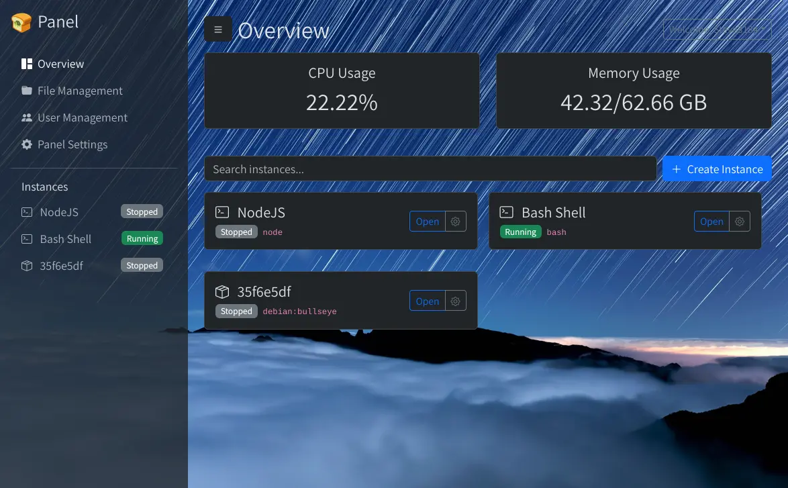<br>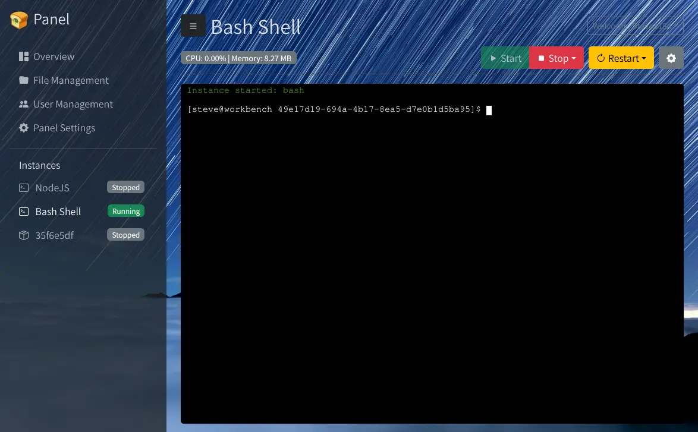<br>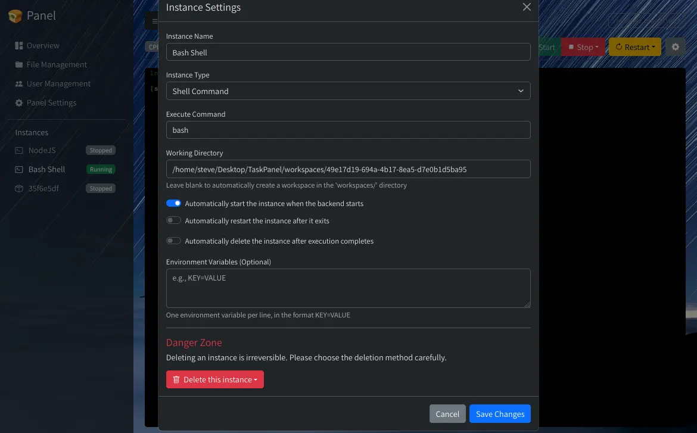</details>

### 👥 用户与 RBAC 权限管理
专为团队设计的安全且灵活的用户管理系统。
-   **角色体系**：区分 `admin`（管理员）和 `user`（普通用户）角色。
-   **细粒度控制**：针对每个实例定义权限：
    -   *终端权限*：无权限、只读、读/写或完全控制。
    -   *文件权限*：独立的文件管理访问开关。
-   **账户安全**：安全的密码更新及账户管理机制。
-   <details><summary>📷 <i>查看截图</i></summary><br>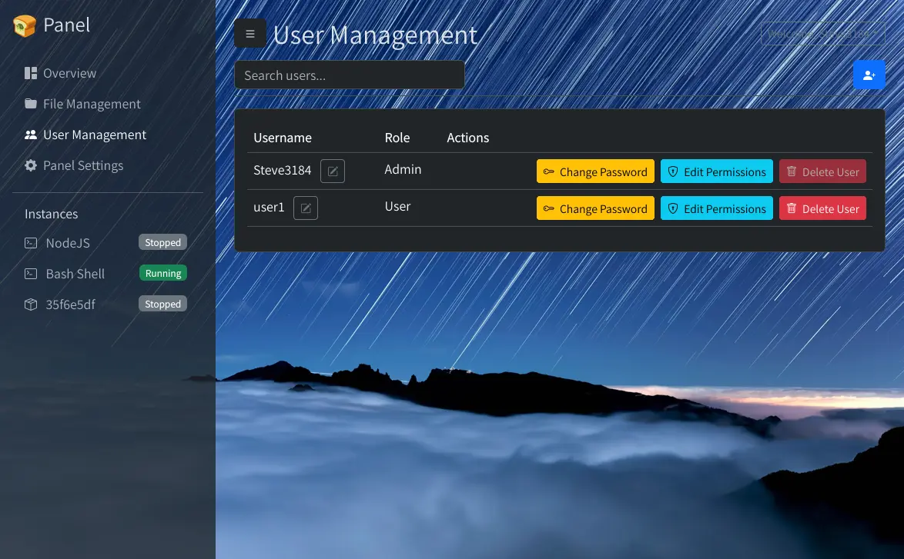<br>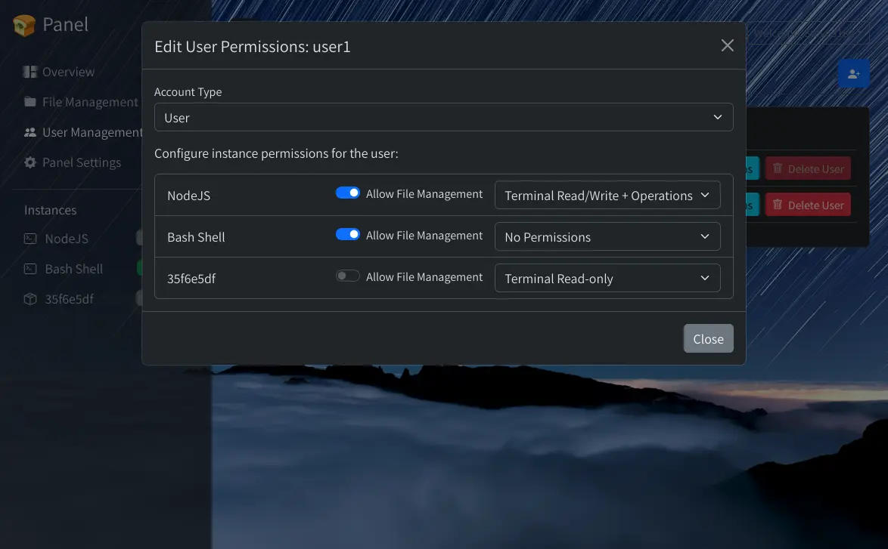</details>

### 📂 高级文件管理
直接在浏览器中体验桌面级的文件管理器。
-   **文件操作**：浏览、创建、重命名、复制、移动（剪切-粘贴）及删除。
-   **传输功能**：支持大文件分片上传及便捷下载。
-   **代码编辑器**：集成 Monaco Editor（VS Code 风格），支持语法高亮及 WebSocket 实时同步。
-   **压缩归档**：支持直接在服务器端进行压缩（zip, 7z, tar.gz 等）和解压（zip, tar, bz2 等）。
-   **安全机制**：针对二进制/系统文件的黑名单保护。
-   <details><summary>📷 <i>查看截图</i></summary><br>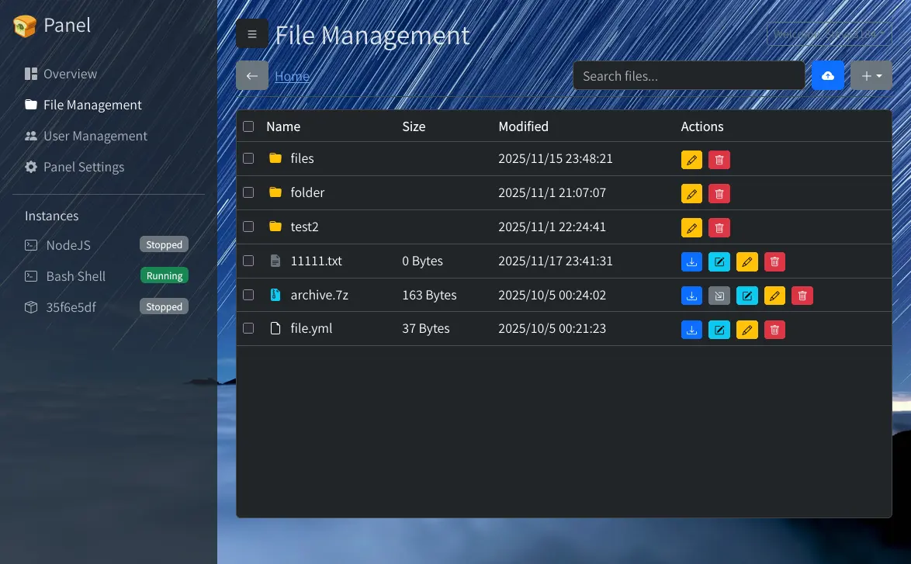<br>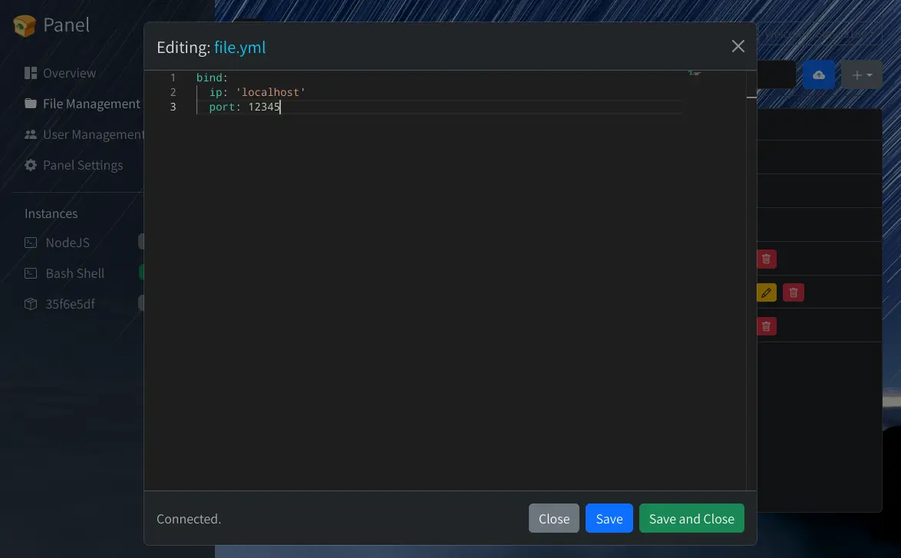</details>

### 🔗 连接与访问
-   **WebDAV 支持**：通过 WebDAV 本地挂载实例文件 (`/api/dav/<instance-id>/`)。
-   **Gradio 隧道**：内置远程访问功能（无需配置 FRP 或端口转发）。
-   **国际化支持**：完整的 i18n 支持（中文、英文、日文等）。
-   **响应式设计**：完美适配手机、平板及桌面端设备。

---

## 🚀 快速开始

### 前置要求
*   **Unzip**: 用于解压发布包
*   **Docker**: （可选）用于容器管理
*   **7-Zip**: （可选）用于高级压缩功能
*   **Bubblewrap**：Linux 发布包已内置；从源码运行时需要单独安装

**注意**：使用预构建版本时**无需**安装 Node.js，因为所有依赖已包含在内。

### 安装

#### 方案 1：从发布版安装（推荐）⚡
*最快部署方式，无需编译工具。*

**Linux x64 系统：**
```bash
# 1. 安装 unzip 和 wget
sudo apt install -y unzip wget

# 2. 下载并解压
sudo mkdir -p /opt/panel && cd /opt/panel
sudo wget https://github.com/Steve3184/panel/releases/download/latest/release-linux-x64.zip
sudo unzip release-linux-x64.zip && sudo rm release-linux-x64.zip

# 3. 配置 Systemd 服务
sudo useradd --system --home-dir /opt/panel --shell /usr/sbin/nologin panel 2>/dev/null || true
sudo chown -R panel:panel /opt/panel
# 仅使用 Docker 实例时需要：
sudo usermod -aG docker panel
sudo wget -O /etc/systemd/system/panel.service https://raw.githubusercontent.com/Steve3184/panel/main/panel.service
sudo systemctl daemon-reload
sudo systemctl enable panel
sudo systemctl start panel
```

**Linux ARM64 系统：**
```bash
# 使用 release-linux-arm64.zip 替代
sudo wget https://github.com/Steve3184/panel/releases/download/latest/release-linux-arm64.zip
sudo unzip release-linux-arm64.zip && sudo rm release-linux-arm64.zip
# ...
```

**Windows x64 系统：**
```powershell
# 从以下地址下载 release-win-x64.zip：
# https://github.com/Steve3184/panel/releases/download/latest/release-win-x64.zip
# 解压后运行：node src/server.js
```

#### 方案 2：从源码构建 🛠️
*适用于开发者或自定义构建。*

<details>
<summary>点击展开构建说明</summary>

1.  **安装 Node.js 22：**
    ```bash
    curl -sL https://deb.nodesource.com/setup_22.x | bash -
    sudo apt install -y nodejs bubblewrap
    ```

2.  **克隆仓库：**
    ```bash
    sudo git clone https://github.com/Steve3184/panel.git /opt/panel
    cd /opt/panel
    ```

3.  **安装依赖并构建：**
    ```bash
    npm install
    cd frontend && npm install
    npm run build
    cd ..
    ```

4.  **配置服务：**
    ```bash
    sudo useradd --system --home-dir /opt/panel --shell /usr/sbin/nologin panel 2>/dev/null || true
    sudo chown -R panel:panel /opt/panel
    # 仅使用 Docker 实例时需要：
    sudo usermod -aG docker panel
    sudo cp panel.service /etc/systemd/system/
    # 如果路径不是 /opt/panel，请编辑服务文件
    sudo systemctl daemon-reload
    sudo systemctl enable panel
    sudo systemctl start panel
    ```
</details>

### 初始化设置
访问 `http://localhost:3000` 进入面板。
如果系统中尚无管理员，页面将自动跳转至 `/setup` 以创建首个账户。

---

## ⚙️ 配置指南

### 环境变量
您可以通过环境变量或修改 `src/server.js` 来配置面板。

| 变量名 | 描述 | 默认值 |
| :--- | :--- | :--- |
| `SESSION_SECRET` | 可选的会话签名与加密密钥（至少 32 字节）。未设置时会在数据目录自动生成并持久化随机密钥。 | 自动生成 |
| `PORT` | 服务器监听的端口。 | `3000` |
| `PANEL_LANG` | 服务端语言设置（例如 `jp`, `en`, `zh_CN`）。 | `en` |
| `PANEL_DATA_DIR` | 数据库、会话、工作区及临时上传文件的可选存放目录。 | 项目目录 |
| `TRUST_PROXY_HOPS` | 面板前方可信反向代理的层数。直接访问时请勿设置。 | `0` |
| `BWRAP_BIN` | 可选的 Bubblewrap 可执行文件绝对路径；未设置时依次检查内置版本和常见系统路径。 | 自动检测 |

**在 `panel.service` 中设置变量：**
编辑 `/etc/systemd/system/panel.service` 并在 `[Service]` 下方添加 `Environment` 行：

```ini
[Service]
Environment="SESSION_SECRET=replace-with-at-least-32-random-bytes"
Environment="PORT=8080"
ExecStart=/usr/bin/node src/server.js
```
*注意：修改后请运行 `sudo systemctl daemon-reload && sudo systemctl restart panel` 使配置生效。*

Shell 实例默认启用沙箱。Linux 发布包内置静态链接的 Bubblewrap；源码安装可以通过 `BWRAP_BIN` 指定或使用系统安装版本。Panel 启动时会实际执行沙箱能力探针。在 Linux 上，如果 Bubblewrap 或所需内核功能不可用，要求沙箱隔离的实例将拒绝启动。Windows 不支持 Bubblewrap，因此原生 Shell 实例不会获得此隔离；不可信的 Windows 工作负载应使用 Docker。

沙箱可用时默认将实例工作目录映射为 `/workspace`，仅提供只读系统运行库，并隐藏面板数据库、会话、Docker socket 和其他主机路径。管理员可以选择在沙箱内保留工作目录的原始绝对路径，此时 `HOME` 也会同步更新；还可以添加最多 32 个已存在的绝对主机路径，作为依赖目录或文件的只读挂载。沙箱路径设置会在实例重启后生效；敏感路径、沙箱保留路径及与可写工作目录重叠的路径不能添加。管理员也可以按实例关闭隔离，但关闭后进程将拥有与 `panel` 系统账户相同的文件和服务访问能力。

### 🔀 反向代理与自定义域名

面板支持通过反向代理（nginx、Caddy、FRP 等）配合自定义域名访问。所需配置取决于 HTTPS 是否由代理终止。

**HTTP 代理——无需额外配置**

包括 nginx HTTP 模式、Caddy 不启用 TLS，以及 FRP vhost HTTP 模式。代理会原样转发 `Host` 和 `Origin` 头，面板的来源校验可以直接通过。

**HTTPS 终止代理——需设置 `TRUST_PROXY_HOPS=1`**

包括 nginx/Caddy 负责 TLS 证书，以及 FRP HTTPS vhost 模式。代理剥离 TLS 后以明文 HTTP 向内转发请求，Express 无法自行感知原始的 `https` 协议。不设置此项时，面板的来源校验会检测到协议不匹配并返回 403。

在 `panel.service` 中添加：
```ini
Environment="TRUST_PROXY_HOPS=1"
```

您的代理还需要转发 `X-Forwarded-Proto: https` 头——大多数 nginx 和 Caddy 的默认配置已包含此项。

> ⚠️ 如果面板直接暴露在公网、前面没有代理，请**不要**设置 `TRUST_PROXY_HOPS`，否则任何客户端都可以伪造协议头。

### 🌍 远程访问 (Gradio 隧道)
面板内置了基于 Gradio 的隧道功能，无需配置路由器端口转发或搭建 FRP，即可在公网访问您的面板。

1.  进入面板的 **面板设置**。
2.  启用 **Gradio Tunnel**。
3.  **重要提示**：请设置 `Share Token`（共享令牌）。这能确保您的公网 URL 保持不变。如果不设置，每次重启都会生成一个随机 URL。
4.  稍等片刻，刷新设置页面即可查看生成的公网链接。

### 🎨 界面个性化
通过 **面板设置** 页面打造属于您的面板：
-   **标题**：修改浏览器标签页和顶栏标题。
-   **Logo**：上传自定义图片作为左上角 Logo。
-   **背景**：设置登录页和仪表盘的自定义壁纸。

---

## 📸 截图预览

| 登录页 | 实例终端 | 面板设置 |
| :---: | :---: | :---: |
| 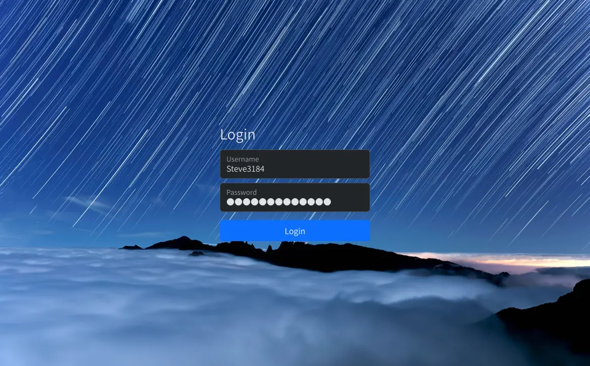 |  | 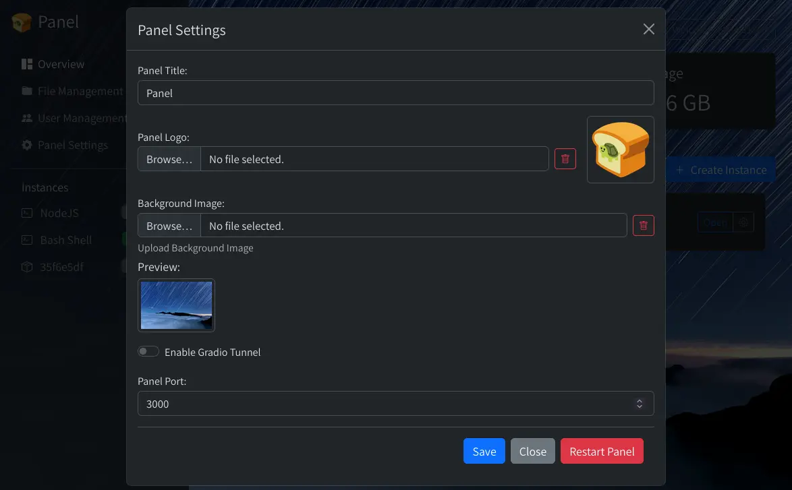 |

| Docker 实例设置 | 文件压缩 |
| :---: | :---: |
| 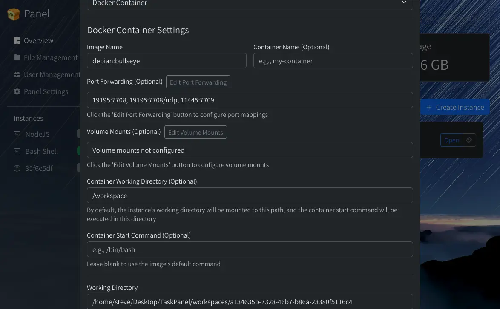 | 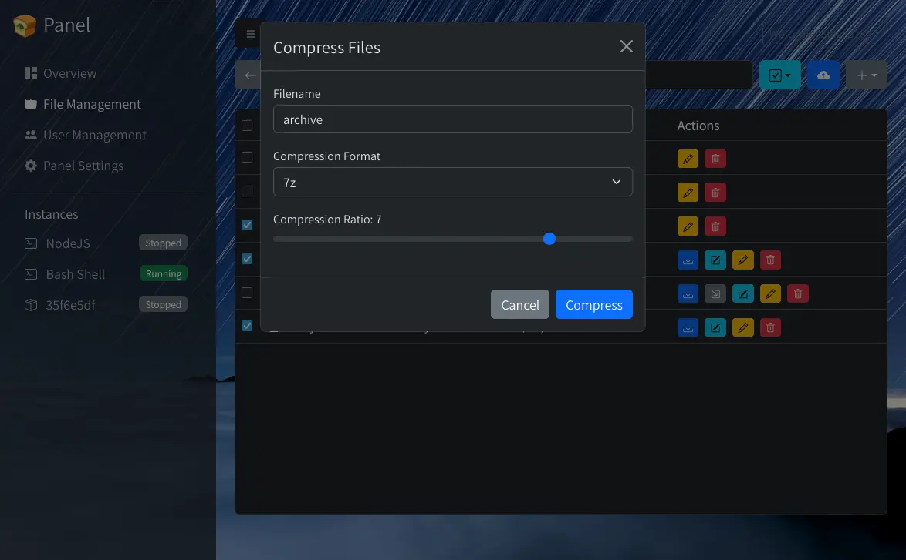 |

---

## 🤝 贡献指南

开源社区之所以如此迷人，是因为这里是学习、激发灵感和创造的乐土。我们**非常感谢**您做出的任何贡献。

## 📄 许可证

本项目基于 MIT 许可证分发。详情请参阅 `LICENSE` 文件。

## ⚠️ 免责声明

**Windows 兼容性**：本面板主要针对 **Linux** 环境开发。虽然它可能在 Windows 上运行，但不保证功能完整性，且可能会出现兼容性问题。

<br>

<p align="center">
  <small><i>本项目包含由 AI 生成或辅助生成的代码</i></small>
</p>
