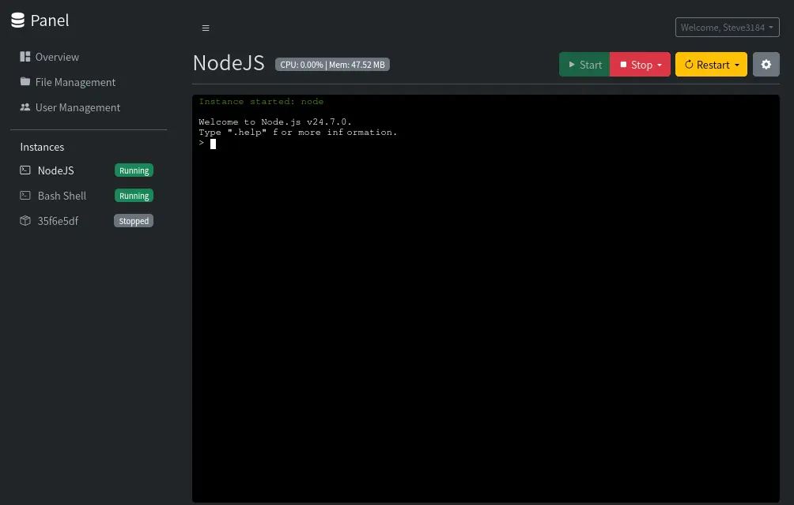
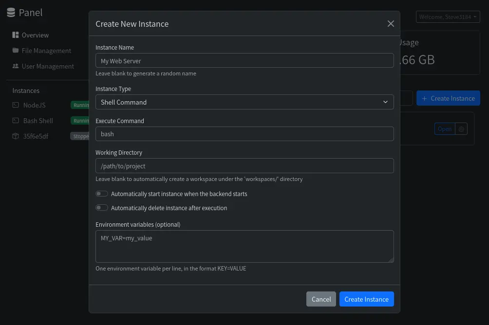

# The Panel

[English](README.md) | 简体中文

一个功能强大且用户友好的网页版服务器管理面板，旨在简化实例、文件和用户的管理。无论您是运行 shell 命令还是管理 Docker 容器，Panel 都提供了一个全面的界面，以实现无缝控制。

## ✨ 功能

-   **实例管理**:
    -   轻松创建、启动、停止、重启和终止实例。
    -   支持 **Shell** 和 **Docker** 两种实例类型。
    -   全面的 Docker 配置选项：镜像、容器名称、端口映射、卷挂载、工作目录和自定义命令。
    -   可配置开机自启、退出时自动删除和自动重启，以实现稳定运行。
    -   实时监控每个实例的 CPU 和内存使用情况。
    -   为所有正在运行的实例提供交互式终端访问。
    -   <details><summary>截图：实例概览</summary></details>
    -   <details><summary>截图：Docker 实例设置</summary></details>

-   **用户与权限管理**:
    -   集中式用户管理，用于创建、删除和编辑用户帐户。
    -   基于角色的访问控制 (RBAC)，包含 `admin` 和 `user` 两种角色。
    -   管理员可以管理用户和实例的所有方面。
    -   精细的单实例权限设置：
        -   **终端访问权限**：无权限、只读、读/写、读/写和操作 (启动/停止/重启)、完全控制。
        -   **文件管理权限**：启用或禁用文件管理功能。
    -   安全的密码和用户名更新功能。
    -   <details><summary>截图：用户管理</summary></details>
    -   <details><summary>截图：实例权限</summary></details>

-   **文件管理**:
    -   直观的文件浏览器，用于导航、创建、删除和重命名文件及文件夹。
    -   高效的文件上传（支持大文件分块上传）和下载功能。
    -   **在线文件编辑器**：集成了 Monaco Editor，支持多种语言的语法高亮、实时保存和基于 WebSocket 的内容同步。
    -   **归档操作**：直接在面板内支持文件压缩 (zip, 7z, tar.gz, tar.xz) 和解压 (zip, 7z, tar, tar.gz, tar.xz, tar.bz2)。
    -   复制和移动（剪切-粘贴）操作，实现灵活的文件组织。
    -   文件编辑黑名单，防止意外修改二进制或不支持的文件类型。
    -   <details><summary>截图：文件浏览器</summary></details>
    -   <details><summary>截图：在线文件编辑器</summary></details>
    -   <details><summary>截图：文件上传</summary></details>
    -   <details><summary>截图：文件压缩</summary></details>
    -   <details><summary>截图：文件解压</summary></details>

-   **国际化 (i18n)**:
    -   前端和后端完全支持多语言，提供本地化体验。

-   **响应式界面**:
    -   现代化且响应式的用户界面，能适应各种屏幕尺寸，在桌面、平板和移动设备上提供一致的体验。
    -   可折叠的侧边栏和文件管理器中的动态布局调整，以实现最佳可用性。

## 🚀 快速入门

### 先决条件

-   Node.js (v22 或更高版本)
    -   **在 Ubuntu/Debian 上快速安装 Node.js 22**:
        ```bash
        curl -sL https://deb.nodesource.com/setup_22.x | bash -
        apt install nodejs
        ```
-   Docker (可选，用于 Docker 实例管理)
-   7-Zip (用于高级归档操作，通常在大多数系统上已预装或由 `7zip-bin` 软件包处理)

### 安装

**推荐将 Panel 安装为 systemd 服务 (适用于 Linux 设备):**

为了获得最佳运行效果，建议将 Panel 安装为 systemd 服务。这可以确保它在后台持续运行，并在系统启动时自动启动。

1.  **安装 Node.js 22 (如果尚未安装):**
    ```bash
    curl -sL https://deb.nodesource.com/setup_22.x | bash -
    sudo apt install -y nodejs
    ```

2.  **将仓库克隆到 `/opt/panel`:**
    ```bash
    sudo git clone https://github.com/Steve3184/panel.git /opt/panel
    cd /opt/panel
    ```

3.  **安装依赖:**
    ```bash
    npm install
    cd frontend && npm install
    ```

4.  **构建前端:**
    ```bash
    npm run build --prefix frontend
    ```

5.  **复制并配置 systemd 服务文件:**
    - a.  将提供的 `panel.service` 文件复制到 systemd 目录：
        ```bash
        sudo cp panel.service /etc/systemd/system/
        ```
    - b.  编辑服务文件，确保 `WorkingDirectory` 和 `ExecStart` 指向正确的路径。由于我们克隆到了 `/opt/panel`，默认的 `panel.service` 应该已经配置正确。如果您选择了不同的安装路径，您需要像下面这样修改它：
        ```
        # 如果您的项目在 /home/user/panel 中的修改示例
        # WorkingDirectory=/home/user/panel
        # ExecStart=/usr/bin/node /home/user/panel/src/server.js
        ```
        **注意**: `ExecStart` 的路径必须是 `server.js` 的绝对路径。

6.  **重新加载 systemd，启用并启动 Panel 服务:**
    ```bash
    sudo systemctl daemon-reload
    sudo systemctl enable panel
    sudo systemctl start panel
    ```

7.  **检查服务状态:**
    ```bash
    systemctl status panel
    ```

8.  **初始设置:**
    首次启动时，如果不存在管理员用户，您将被重定向到 `http://localhost:3000/setup` 来创建一个管理员帐户。

### 配置

您可以通过设置 `PANEL_LANG` 环境变量来配置服务器语言。例如，要将语言设置为日语：

```bash
PANEL_LANG=jp npm start
```

支持的语言定义在 `public/lang/` 目录中 (例如 `en.json`, `zh_CN.json`, `jp.json`)。

## 📸 屏幕截图

-   **登录页面**:
    

-   **概览仪表盘**:
    

-   **实例终端**:
    

-   **创建实例模态框**:
    

-   **文件管理器 - 目录视图**:
    

-   **文件管理器 - 文件编辑器**:
    

## 🤝 贡献

欢迎贡献！随时可以提交 issues 或 pull requests。

## 📄 许可证

本项目基于 MIT 许可证 - 详情请见 [LICENSE](LICENSE) 文件。

## 免责声明

**Windows 兼容性**:
此面板主要为 Linux 设备开发。其在 Windows 上的功能未经全面测试，可能会遇到兼容性问题。

<small>本仓库包含由 AI 生成或辅助生成的代码。虽然我们已努力确保其质量和功能，但用户在使用和部署前应彻底审查和测试代码。</small>
